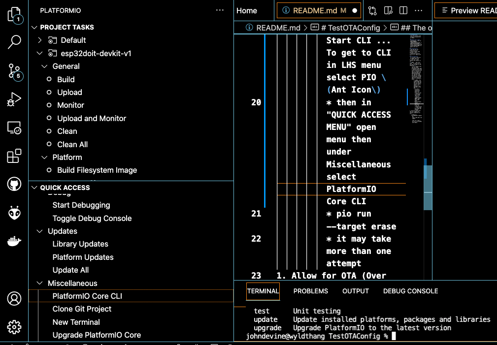

# TestOTAConfig
 Test Over The Air and Initial Configuration of ESP32
___
 ## Watch this video:
 [Wifimanager + OTA for ESP32/ESP8266 \(ESPAsyncWifimanager \/ ESPAsyncElegantOTA\)](
 https://www.youtube.com/watch?v=UlRLTvl4DRc "A great site too")
___
## Configuration
* Mac Mini Mac OS Catalina 10.15.7 
* Visual Studio code Version: 1.63.2
* Platformio Version: Core 5.2.4  Home 3.4.0
___
## The objective:
 Is to have a base for an ESP32 that can:
1. Look for a wifi network and connect to it. 
__\(NOTE .. The first time   it starts up it will go straight to the webserver\)__
    * If it cannot find the one saved previously then open a captive portal web server and allow the user to connect to that and input the SSID and Password for the WiFi that you want to connect to and then to keep that entry and use that for subsequent boots.
        * __NOTE__ the credentials are held in NVR and the only way to totally remove them is to manually clear the NVR on the ESP.
          * In VSC + Platformio extension\)Start CLI ... To get to CLI in LHS menu select PIO \(Ant Icon\)
          * then in "QUICK ACCESS MENU" open menu then under Miscellaneous select PlatformIO Core CLI
          * pio run --target erase
          * it may take more than one attempt
1. Allow for OTA (Over The Air) updates by having a webserver on url:
   * http:\/\/(YourESP32IP)\/update 
     eg 
     http://192.168.2.42/update
     
     that will load a .bin up to the ESP32 and reboot.
